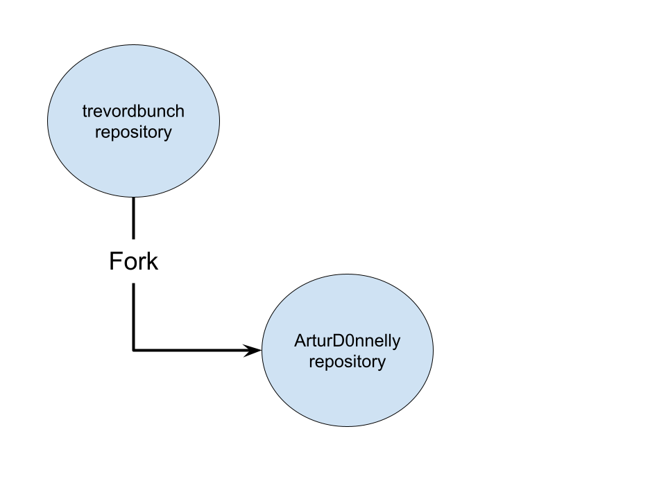

# Lab Report: Continuous Integration
___
**Course:** CIS 411, Spring 2021  
**Instructor(s):** [Trevor Bunch](https://github.com/trevordbunch)  
**Name:** [Seth Donnelly](https://github.com/ArturD0nnelly)  
**GitHub Handle:** ArturD0nnelly  
**Repository:** [cis411_lab1_CI](https://github.com/ArturD0nnelly/cis411_lab1_CI.git) 
___

# Step 1: Fork this repository
- The URL of my forked repository: [cis411_lab1_CI](https://github.com/ArturD0nnelly/cis411_lab1_CI.git)
- The accompanying diagram of what my fork precisely and conceptually represents...
  

# Step 2: Clone your forked repository from the command line  
- My local file directory is: `C:\Users\artir\Documents\GitHub\cis411_lab1_CI`
- The command to navigate to the directory when I open up the command line is: `cd Documents/GitHub/cis411_lab1_CI`

# Step 3: Run the application locally
- My GraphQL response from adding myself as an account on the test project
``` json
{
  "data": {
    "mutateAccount": {
      "id": "21089d07-26c4-4d2f-864a-9094ccd230d2",
      "name": "Seth Artur Donnelly",
      "email": "artirstepnov@gmail.com"
    }
  }
}
```

# Step 4: Creating a feature branch
- The output of my git commit log
```
5dca7bf (HEAD -> labreport, origin/labreport) Working through step 5
88e2738 creating new branch from forked repository of @trevordbunch
7490dcb (upstream/main, origin/main, origin/HEAD, main) Add Links to Node in Instructions
ecaaa53 Update branch terminology
c552213 Merge pull request #3 from hallienicholas/main
78ede9f Corrected error
1fe415c Merge pull request #1 from trevordbunch/labreport
13e571f Update Lab readme, instructions and templates
eafe253 Adjust submitting instructions
47e83cd Add images to LabReport
ec18770 Add Images
dbf826a Answer Step 4
a9c1de6 Complete Step 1, 2 and 3 of LAB_TREVORDBUNCH
1ead543 remove LAB.md
8c38613 Initial commit of labreport with @tangollama
dabceca Merge pull request #24 from tangollama/circleci
a4096db Create README.md
2f01bf4 Update LAB_INSTRUCTIONS.md
347bd50 Update LAB_INSTRUCTIONS.md
7aaa9f3 Update LAB_INSTRUCTIONS.md
37393ae Bug fixed
1949d2a Update LAB_INSTRUCTIONS.md
d36ad90 Update LAB.md
59ef18a Update LAB_INSTRUCTIONS.md
37be3c8 Update LAB_INSTRUCTIONS.md
97da547 Update LAB.md
0bd6244 updated Step 0 title
4562cd8 added npm and node install repreq
255051e adding template
13a09b7 Adding the LAB.md and correcting some instructions.
d2ddea5 Version 0.0.1 of the lab isntructions
ab312fc more progress
62fb0a5 more progress
fe1937b more in the lab instructions
3e807fb first section
9ae6b83 remove LAB.md
e429c1a lab instructions
ce1fcea circleci default config
80bbdbb circleci default config
968099e remove test db
7362cd1 working
44ce6ae Initial commit

```
- The accompanying diagram of what my feature branch precisely and conceptually represents:
  

# Step 5: Setup a Continuous Integration configuration
- What is the .circleci/config.yml doing?  
  - As I can tell, the `config.yml` is used to communicate back and forth between the GitHub repository and Circle.ci. I believe it tells the Circle.ci about what changes were made and information about the project.

- What do the various sections on the config file do?
  - Orbs: If I'm not wrong, these are the packages that help to move from one project to another. 
  - Workflows: This is the set of steps it takes for the build to succeed.
  - Jobs: This is the collection of processes that were already executed. I this case it contains only one job. 
   

- When a CI build is successful, what does that philosophically and practically/precisely indicate about the build?  
  If the CI build is successful it indicates that the build has passed all of the steps and that there is nothing wrong (no errors) with the code. Practically speaking, it doesn't mean that the code will do what you want it to do. It just means that there is no error that occurred.
   

- If you were to take the next step and ready this project for Continuous Delivery, what additional changes might you make in this configuration (conceptual, not code)?  
  The configuration that I would change is the deployment area. Before moving it to Continuous Delivery I would like it to be checked by running through circle.ci to see if everything is okay. Also, the last step in moving the project to Continuous Delivery should be done by humans. The machines and code are good, but it should be finalized by the person.
  
# Step 6: Merging the feature branch
* The output of my git commit log
```
Trevors-MBP:cis411_lab0 trevorbunch$ git log --oneline
dbf826a (HEAD -> labreport, origin/labreport) Answer Step 4
a9c1de6 Complete Step 1, 2 and 3 of LAB_TREVORDBUNCH
1ead543 remove LAB.md
8c38613 Initial commit of labreport with @tangollama
dabceca (upstream/main, origin/main, origin/HEAD, main) Merge pull request #24 from tangollama/circleci
a4096db Create README.md
...
44ce6ae Initial commit
(END)
```

* A screenshot of the _Jobs_ list in CircleCI


# Step 7: Submitting a Pull Request
_Remember to reference at least one other student in the PR content via their GitHub handle._


# Step 8: [EXTRA CREDIT] Augment the core project
PR reference in the report to one of the following:
1. Add one or more unit tests to the core assignment project. 
2. Configure the CircleCI config.yml to automatically build a Docker image of the project.
3. Configure an automatic deployment of the successful CircleCI build to an Amazon EC2 instance.
