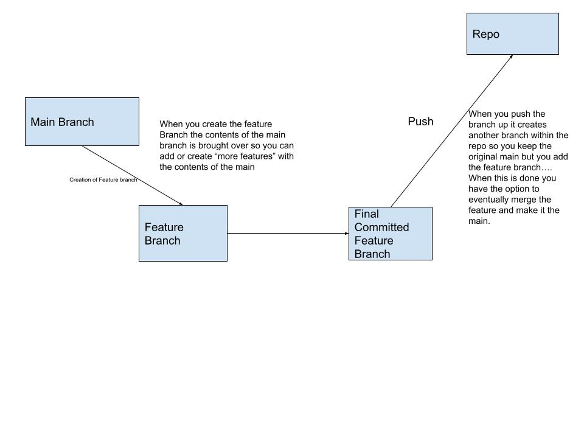
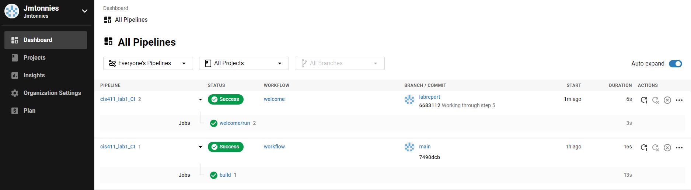

**Course:** CIS 411, Spring 2021  
**Instructor(s):** [Trevor Bunch](https://github.com/trevordbunch)  
**Name:** Joseph Tonnies  
**GitHub Handle:** Jmtonnies  
**Repository:** https://github.com/Jmtonnies/cis411_lab1_CI 
___

# Step 1: Fork this repository
- The URL of my forked repository: 
  - https://github.com/Jmtonnies/cis411_lab1_CI
- The accompanying diagram of what my fork precisely and conceptually represents...


# Step 2: Clone your forked repository from the command line  
- My local file directory is...
  - C:\Users\hotwh\Documents\GitHub\cis411_lab1_CI
- The command to navigate to the directory when I open up the command line is...
  - cd"C:\Users\hotwh\Documents\GitHub\cis411_lab1_CI"

# Step 3: Run the application locally
- My GraphQL response from adding myself as an account on the test project
``` 
{
  "data": {
    "mutateAccount": {
      "id": "5f808cd0-dff1-4d77-9b5b-0854d639c8f7",
      "name": "Joseph Tonnies",
      "email": "Jmtonnies@gmail.com"
    }
  }
}
```

# Step 4: Creating a feature branch
- The output of my git commit log
```
commit 5d2dda3fd631e1832c712e2a6782911456f76499
Author: Jmtonnies <jmtonnies@gmail.com>
Date:   Fri Feb 19 16:03:51 2021 -0500

    Running npm and creating feature brach

    Did step 1 - 4

```
*Comment: I apologize for the committing this after this step when reviewing I realized I needed to commit after step 3.*

- The accompanying diagram of what my feature branch precisely and conceptually represents



# Step 5: Setup a Continuous Integration configuration
- What is the .circleci/config.yml doing:  

  - The config file is a sort of validation file to talk back and forth between our Github and Circle.ci. It is telling Circle.ci what is changing along with identifying the project it is in.


- What do the various sections on the config file do?
  - Orbs: Open source sharable packages that help with moving from one project to the next 
  - Workflows: A set of rules defining when something should run basically. 
  - Jobs: A collection of steps that are executed in a container that would be run in something like docker.

  - Steps: The executable commands within the job.

  - *Summarized from Source: https://circleci.com*
    
   

- When a CI build is successful, what does that philosophically and practically/precisely indicate about the build? 
  - It indicates that the build is stable enough to run without any errors. It does not mean that the code does exactly what you are expect jus that it does not crash the system.
   

- If you were to take the next step and ready this project for Continuous Delivery, what additional changes might you make in this configuration (conceptual, not code)?
  - This configuration has no where to go deployment-wise so I would include the ability to deploy to an orchestrator. So run through Circle.Ci which would then say it was all good (The canary would not die) then it would have the ability to deploy.
   

# Step 6: Merging the feature branch
* The output of my git commit log
```
Author: Jmtonnies <jmtonnies@gmail.com>
Date:   Fri Feb 19 17:16:29 2021 -0500

    Working through step 5

    Committing after getting a success link to CIrcle.ci

commit f47fb1c10641b144daf2c48910cb7db32546ebf6 (origin/labreport)
Author: Jmtonnies <jmtonnies@gmail.com>
Date:   Fri Feb 19 16:05:46 2021 -0500

    Create config.yml

commit 5d2dda3fd631e1832c712e2a6782911456f76499
Author: Jmtonnies <jmtonnies@gmail.com>
Date:   Fri Feb 19 16:03:51 2021 -0500

    Running npm and creating feature brach

    Did step 1 - 4


```

* A screenshot of the _Jobs_ list in CircleCI

