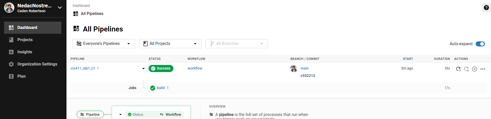

# Lab Report: Continuous Integration
___
**Course:** CIS 411, Spring 2021  
**Instructor(s):** [Trevor Bunch](https://github.com/trevordbunch)  
**Name:** Caden Robertson
**GitHub Handle:** NedacNostrebor
**Repository:** https://github.com/NedacNostrebor/cis411_lab1_CI
___

# Step 1: Fork this repository
- The URL of my forked repository: https://github.com/NedacNostrebor/cis411_lab1_CI
- The accompanying diagram of what my fork precisely and conceptually represents...
- [Fork Diagram](../assets/NedacNostrebor_Fork.png)
# Step 2: Clone your forked repository from the command line  
- My local file directory is ```C:Users\Sling\Git_test\cis411lab_CI```
- The command to navigate to the directory when I open up the command line is ```cd cis411_lab1_CI```

# Step 3: Run the application locally
- My GraphQL response from adding myself as an account on the test project
``` json
{
  "data": {
    "mutateAccount": {
      "id": "17df29db-2c8f-456a-a970-fba699ce6fcf",
      "name": "Caden N. Robertson",
      "email": "cr1350@messiah.edu"
    }
  }
}
```

# Step 4: Creating a feature branch
- The output of my git commit log
``` powershell
d7b4a9f (HEAD -> labreport, origin/labreport) Coppied lab report template @trevordbunch
c552213 (origin/main, origin/HEAD, main) Merge pull request #3 from hallienicholas/main
78ede9f Corrected error
1fe415c Merge pull request #1 from trevordbunch/labreport
13e571f Update Lab readme, instructions and templates
eafe253 Adjust submitting instructions
47e83cd Add images to LabReport
ec18770 Add Images
dbf826a Answer Step 4
a9c1de6 Complete Step 1, 2 and 3 of LAB_TREVORDBUNCH
1ead543 remove LAB.md
```
- The accompanying diagram of what my feature branch precisely and conceptually represents...
- [Branch Diagram](../assets/NedacNostrebor_Branch.png)

# Step 5: Setup a Continuous Integration configuration
- What is the .circleci/config.yml doing?  
It tells CircleCI how to configure to work with the code.

- What do the various sections on the config file do?  
   Orb: A reusable package of YAML configuration that condenses repeated pieces of ocnfig into a single line of code.
   Workflows: A set of rules for defining a collection of jobs and their run order.
   Jobs: a collection of steps.

- When a CI build is successful, what does that philosophically and practically/precisely indicate about the build?  
   It indicates that the build is stable and is successfully integrated.

- If you were to take the next step and ready this project for Continuous Delivery, what additional changes might you make in this configuration (conceptual, not code)?  
   I don't think I would make any changes

# Step 6: Merging the feature branch
* The output of my git commit log
``` powershell
9799e23 (HEAD -> main, labreport) Lab report Finished
cd1229e lab report progress
da2430c Half done lab report
d7b4a9f (origin/labreport) Coppied lab report template @trevordbunch
c552213 (origin/main, origin/HEAD) Merge pull request #3 from hallienicholas/main
78ede9f Corrected error
1fe415c Merge pull request #1 from trevordbunch/labreport
13e571f Update Lab readme, instructions and templates
eafe253 Adjust submitting instructions
47e83cd Add images to LabReport
ec18770 Add Images
```

* A screenshot of the _Jobs_ list in CircleCI


# Step 7: Submitting a Pull Request
_Remember to reference at least one other student in the PR content via their GitHub handle._


# Step 8: [EXTRA CREDIT] Augment the core project
PR reference in the report to one of the following:
1. Add one or more unit tests to the core assignment project. 
2. Configure the CircleCI config.yml to automatically build a Docker image of the project.
3. Configure an automatic deployment of the successful CircleCI build to an Amazon EC2 instance.
