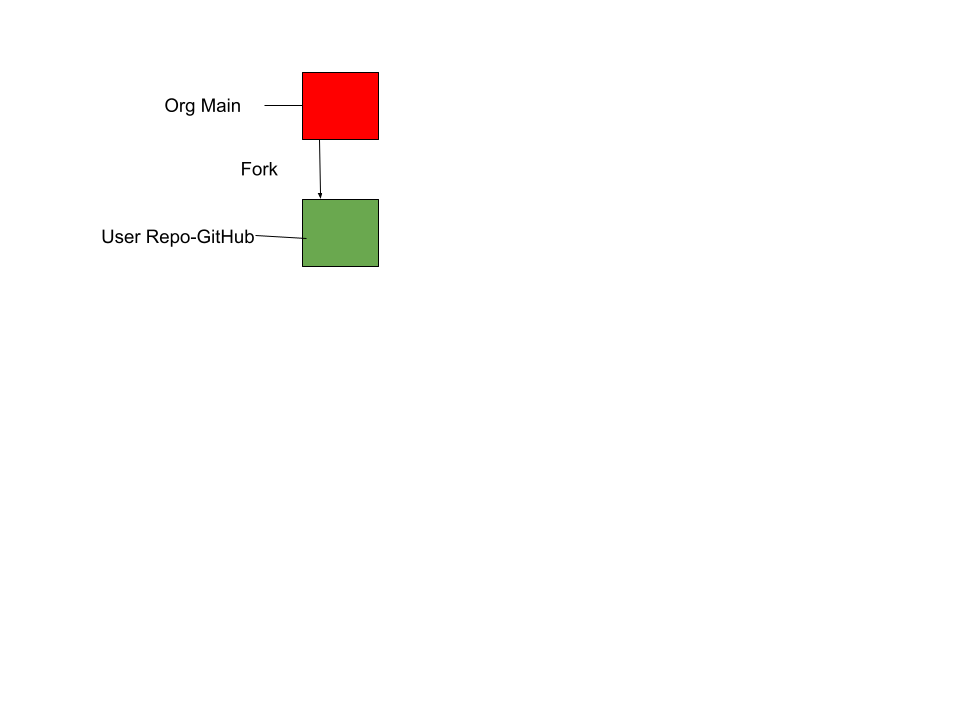
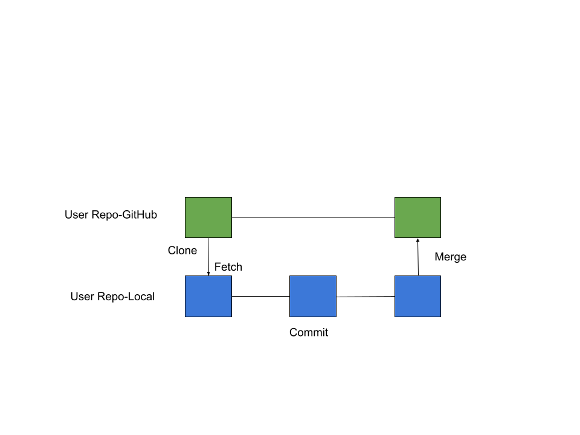

# Lab Report: Continuous Integration
___
**Course:** CIS 411, Spring 2021  
**Instructor(s):** [Trevor Bunch](https://github.com/trevordbunch)  
**Name:** Roman Searle  
**GitHub Handle:** RomanSearle
**Repository:** https://github.com/RomanSearle/cis411_lab1_CI 
___

# Collaboration
- @alecclyde - assisted with the part 5 questions
- @mcjo163 - assisted with the part 5 questions, yml config file contents, and looked over my diagrams
- @NedacNostrebor - helped with yml file contents
- @hallienicholas - assisted with log files

# Step 1: Fork this repository
- The URL of my forked repository: https://github.com/RomanSearle/cis411_lab1_CI/tree/purelab
- The accompanying diagram of what my fork precisely and conceptually represents...


# Step 2: Clone your forked repository from the command line  
- My local file directory is C:\Users\Roman\Documents\GitHub\cis411_lab1_CI\labreports
- The command to navigate to the directory when I open up the command line is $ cd Documents/GitHub/cis411_lab1_CI/labreports/


# Step 3: Run the application locally
- My GraphQL response from adding myself as an account on the test project
``` json
{
  "data": {
    "mutateAccount": {
      "id": "824f34cd-c0f1-4408-bc91-3df51e5cbe6b",
      "name": "Roman Searle",
      "email": "rs1503@messiah.edu"
    }
  }
}   
```

# Step 4: Creating a feature branch
- The output of my git commit log
```
Trevors-MBP:cis411_lab0 trevorbunch$ git log --oneline
dbf826a (HEAD -> labreport, origin/labreport) Answer Step 4
a9c1de6 Complete Step 1, 2 and 3 of LAB_TREVORDBUNCH
1ead543 remove LAB.md
8c38613 Initial commit of labreport with @tangollama
dabceca (upstream/main, origin/main, origin/HEAD, main) Merge pull request #24 from tangollama/circleci
a4096db Create README.md
...
44ce6ae Initial commit
(END)
```
- The accompanying diagram of what my feature branch precisely and conceptually represents...



# Step 5: Setup a Continuous Integration Configuration
- What is the .circleci/config.yml doing?  

The .circleci/config.yml file is providing the configuration options for the IQ server installation.

- What do the various sections on the config file do?  
  - Orbs are a package of configurations.
  - Node is a specific package to be used.
  - Workflow is a set of rules that define how jobs should be run.
  - Node-test are tests for the imported nodes.
  - Jobs are a collection of steps that run scripts.
  - The -node/test is the command that runs the node test.
   
- When a CI build is successful, what does that philosophically and practically/precisely indicate about the build?  
   
When a CI build is sucessful, it means that the code has passed the tests and will run. This does not mean that the code will function as intended. It only means the code will run.

- If you were to take the next step and ready this project for Continuous Delivery, what additional changes might you make in this configuration (conceptual, not code)?  
   
If I were to take the next step and ready the project for Continuous Delivery, I would make several changes. First, I would set up an automated release process. I would also use feature flags so changes I do not want to immediately deploy do not get automatically sent out with the rest of the project. 

# Step 6: Merging the feature branch
* The second output of my git commit log
```
$ git log --oneline
272ee5f (HEAD -> labreport) After circleci maybe im confused
027c46b (origin/labreport) step 4 @trevordbunch
f8513e0 (upstream/purelab, origin/purelab, purelab, lapreport) Update Node links to Instructions
d4f22eb Update repo branch names
0e3ae4c Reset purelab
050b420 Merge pull request #2 from trevordbunch/main
1fe415c Merge pull request #1 from trevordbunch/labreport
13e571f Update Lab readme, instructions and templates
eafe253 Adjust submitting instructions
47e83cd Add images to LabReport
ec18770 Add Images
dbf826a Answer Step 4
a9c1de6 Complete Step 1, 2 and 3 of LAB_TREVORDBUNCH
1ead543 remove LAB.md
8c38613 Initial commit of labreport with @tangollama
dabceca Merge pull request #24 from tangollama/circleci
a4096db Create README.md
2f01bf4 Update LAB_INSTRUCTIONS.md
347bd50 Update LAB_INSTRUCTIONS.md
7aaa9f3 Update LAB_INSTRUCTIONS.md
37393ae Bug fixed
1949d2a Update LAB_INSTRUCTIONS.md
:
```


* A screenshot of the _Jobs_ list in CircleCI


# References 
https://help.sonatype.com/iqserver/configuring/config.yml

https://circleci.com/landing-pages/assets/Big-Book-of-Workflows-2018.pdf

https://circleci.com/developer/orbs

https://circleci.com/docs/2.0/using-orbs/

https://circleci.com/docs/2.0/project-walkthrough/

https://circleci.com/docs/2.0/concepts/#user-types

https://www.atlassian.com/continuous-delivery/principles/continuous-integration-vs-delivery-vs-deployment