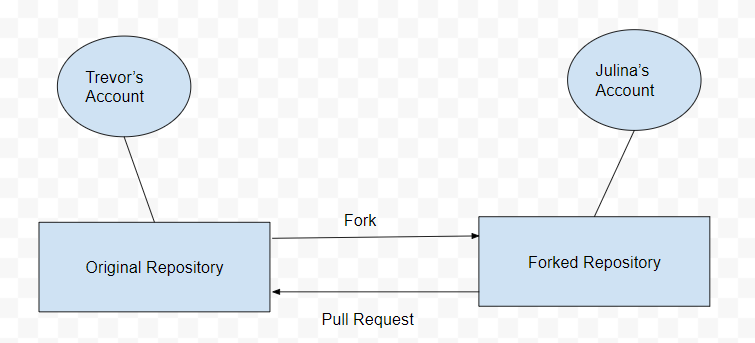
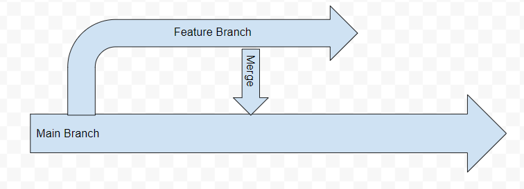
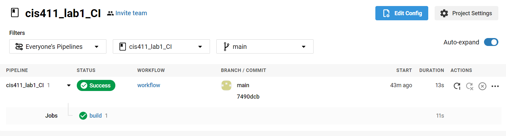

# Lab Report: Continuous Integration
___
**Course:** CIS 411, Spring 2021  
**Instructor(s):** [Trevor Bunch](https://github.com/trevordbunch)  
**Name:** Julina Metz  
**GitHub Handle:** [julinametz](https://github.com/julinametz)  
**Repository:** https://github.com/julinametz/cis411_lab1_CI  
___

# Step 1: Fork this repository
- The URL of my forked repository: https://github.com/julinametz/cis411_lab1_CI
- The accompanying diagram of what my fork precisely and conceptually represents: 
    

# Step 2: Clone your forked repository from the command line  
- My local file directory is C:\Users\julin\Documents\GitHub\cis411_lab1_CI
- The command to navigate to the directory when the command line is opened: cd Documents\GitHub\cis411_lab1_CI

# Step 3: Run the application locally

``` json
{
  "data": {
    "mutateAccount": {
      "id": "ea11ad87-025a-44e3-aafa-622761f9d0ef",
      "name": "Julina Metz",
      "email": "jm1879@messiah.edu"
    }
  }
}
```

# Step 4: Creating a feature branch
- The output of my git commit log
```
ea5c35c (HEAD -> labreport, origin/labreport) first commit @trevordbunch
7490dcb (origin/main, origin/HEAD, main) Add Links to Node in Instructions
ecaaa53 Update branch terminology
c552213 Merge pull request #3 from hallienicholas/main
78ede9f Corrected error
1fe415c Merge pull request #1 from trevordbunch/labreport
13e571f Update Lab readme, instructions and templates
eafe253 Adjust submitting instructions
47e83cd Add images to LabReport
ec18770 Add Images
dbf826a Answer Step 4
a9c1de6 Complete Step 1, 2 and 3 of LAB_TREVORDBUNCH
1ead543 remove LAB.md
8c38613 Initial commit of labreport with @tangollama
dabceca Merge pull request #24 from tangollama/circleci
a4096db Create README.md
2f01bf4 Update LAB_INSTRUCTIONS.md
347bd50 Update LAB_INSTRUCTIONS.md
7aaa9f3 Update LAB_INSTRUCTIONS.md
37393ae Bug fixed
1949d2a Update LAB_INSTRUCTIONS.md
d36ad90 Update LAB.md
59ef18a Update LAB_INSTRUCTIONS.md
37be3c8 Update LAB_INSTRUCTIONS.md
97da547 Update LAB.md
0bd6244 updated Step 0 title
4562cd8 added npm and node install repreq
255051e adding template
13a09b7 Adding the LAB.md and correcting some instructions.
d2ddea5 Version 0.0.1 of the lab isntructions
ab312fc more progress
62fb0a5 more progress
fe1937b more in the lab instructions
3e807fb first section
9ae6b83 remove LAB.md
e429c1a lab instructions
ce1fcea circleci default config
80bbdbb circleci default config
968099e remove test db
```
- The accompanying diagram of what my feature branch precisely and conceptually represents:
  

# Step 5: Setup a Continuous Integration configuration
- What is the .circleci/config.yml doing?  
  
  The configuration file allows you to define orbs, workflows, and jobs. These allow you to run testing jobs and configure deployment rules for your project. The workflow gives you control over the order jobs are run in. The goal of the config.yml file is to test and then successfully integrate new builds into your project. 


- What do the various sections on the config file do?  

  **Orbs** – This section contains open-source packages that can be added to make configuration easier.   
  **Workflows** – This section contains jobs that will be done when a new build is to be integrated. The jobs are performed in the order they are listed.  
  **Jobs** – This section contains the jobs that are run on a new build when it is integrated. The jobs allow you to have control over the testing and deployment. 

   

- When a CI build is successful, what does that philosophically and practically/precisely indicate about the build?  
  
  It means the build was successfully integrated and passed the testing that is performed when a new build is integrated. It does not necessarily mean the new build won’t cause some unexpected problems, but it does indicate the new build will be able to run.
   

- If you were to take the next step and ready this project for Continuous Delivery, what additional changes might you make in this configuration (conceptual, not code)?  
  
  I would add jobs for testing and rules for deployment. 
   

# Step 6: Merging the feature branch
* The output of my git commit log
```
07a74d5 (HEAD -> main, labreport) updated config.yml
ea5c35c (origin/labreport) first commit @trevordbunch
7490dcb (origin/main, origin/HEAD) Add Links to Node in Instructions
ecaaa53 Update branch terminology
c552213 Merge pull request #3 from hallienicholas/main
78ede9f Corrected error
1fe415c Merge pull request #1 from trevordbunch/labreport
13e571f Update Lab readme, instructions and templates
eafe253 Adjust submitting instructions
47e83cd Add images to LabReport
ec18770 Add Images
dbf826a Answer Step 4
a9c1de6 Complete Step 1, 2 and 3 of LAB_TREVORDBUNCH
1ead543 remove LAB.md
8c38613 Initial commit of labreport with @tangollama
dabceca Merge pull request #24 from tangollama/circleci
a4096db Create README.md
2f01bf4 Update LAB_INSTRUCTIONS.md
347bd50 Update LAB_INSTRUCTIONS.md
7aaa9f3 Update LAB_INSTRUCTIONS.md
37393ae Bug fixed
1949d2a Update LAB_INSTRUCTIONS.md
d36ad90 Update LAB.md
59ef18a Update LAB_INSTRUCTIONS.md
37be3c8 Update LAB_INSTRUCTIONS.md
97da547 Update LAB.md
0bd6244 updated Step 0 title
4562cd8 added npm and node install repreq
255051e adding template
```

* A screenshot of the _Jobs_ list in CircleCI


# Step 7: Submitting a Pull Request

