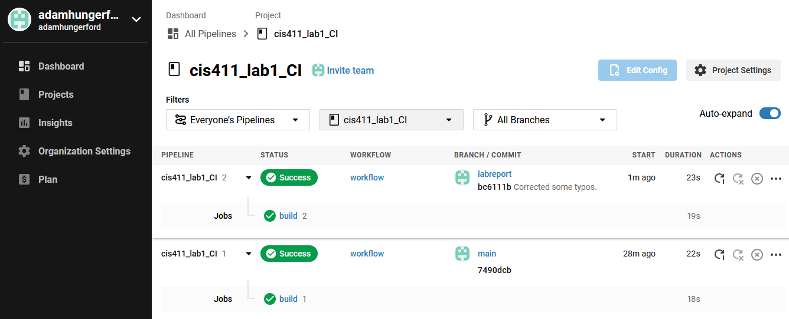

# Lab Report: Continuous Integration
___
**Course:** CIS 411, Spring 2021  
**Instructor(s):** [Trevor Bunch](https://github.com/trevordbunch)  
**Name:** Robbie Dorsey  
**GitHub Handle:** airgo32  
**Repository:** https://github.com/airgo32/cis411_lab1_CI  
___

# Step 1: Fork this repository
- The URL of my forked repository: https://github.com/airgo32/cis411_lab1_CI
- The accompanying diagram of what my fork precisely and conceptually represents:   


# Step 2: Clone your forked repository from the command line  
- My local file directory is:   
 `C:\Users\Robbie\Documents\HW\CIS 411\Continuous Integration Lab\cis411_lab1_CI`
- The command to navigate to the directory when I open up the command line is:  
`cd "Documents/HW/CIS 411/Continuous Integration Lab/cis411_lab1_CI"`

# Step 3: Run the application locally
- My GraphQL response from adding myself as an account on the test project
``` json
{
  "data": {
    "mutateAccount": {
      "id": "ebbac8cb-3a9b-454f-8c96-962dc09fedea",
      "name": "Robbie Dorsey",
      "email": "rd1288@messiah.edu"
    }
  }
}
```

# Step 4: Creating a feature branch
- The output of my git commit log
```
09d4468 (HEAD -> labreport, origin/labreport) copied lab report template for @trevordbunch continuous integration lab
7490dcb (origin/main, origin/HEAD, main) Add Links to Node in Instructions
ecaaa53 Update branch terminology
c552213 Merge pull request #3 from hallienicholas/main
78ede9f Corrected error
1fe415c Merge pull request #1 from trevordbunch/labreport
13e571f Update Lab readme, instructions and templates
eafe253 Adjust submitting instructions
47e83cd Add images to LabReport
ec18770 Add Images
dbf826a Answer Step 4
a9c1de6 Complete Step 1, 2 and 3 of LAB_TREVORDBUNCH
1ead543 remove LAB.md
8c38613 Initial commit of labreport with @tangollama
dabceca Merge pull request #24 from tangollama/circleci
a4096db Create README.md
2f01bf4 Update LAB_INSTRUCTIONS.md
347bd50 Update LAB_INSTRUCTIONS.md
7aaa9f3 Update LAB_INSTRUCTIONS.md
37393ae Bug fixed
1949d2a Update LAB_INSTRUCTIONS.md
d36ad90 Update LAB.md
59ef18a Update LAB_INSTRUCTIONS.md
37be3c8 Update LAB_INSTRUCTIONS.md
97da547 Update LAB.md
0bd6244 updated Step 0 title
4562cd8 added npm and node install repreq
255051e adding template
13a09b7 Adding the LAB.md and correcting some instructions.
d2ddea5 Version 0.0.1 of the lab isntructions
ab312fc more progress
62fb0a5 more progress
fe1937b more in the lab instructions
3e807fb first section
9ae6b83 remove LAB.md
e429c1a lab instructions
ce1fcea circleci default config
80bbdbb circleci default config
968099e remove test db
7362cd1 working
44ce6ae Initial commit
```
- The accompanying diagram of what my feature branch precisely and conceptually represents:   


# Step 5: Setup a Continuous Integration configuration
- What is the .circleci/config.yml doing?  

It looks like .circleci/config.yml is running a series of procedures each time code is committed. This particular config.yml checks out a copy of the code first. Then it checks for a cache. This won't be saved on the first run, but a second run it should find something, as a cache is saved later. As for what is being stored in that cache, I don't know. Then it installs something called yarn, followed by saving that cache that will be accessed later. Lastly, it runs yarn, which I'm assuming hosts a variety of tests for the software.

- What do the various sections on the config file do?  
   
The various sections define certain jobs that take place every commit, as well as the steps and details of those jobs. The default commit.yml has one job, which is called 'build.' Then in build, there's a series of steps that occur, which includes checking out the code to be tested, restoring the cache, installing yarn, saving the cache, and running yarn test.

- When a CI build is successful, what does that philosophically and practically/precisely indicate about the build?  
   
When a CI build is successful, it means any new changes have not broken the code in any way. An unsuccessful build would mean that something new written didn't work correctly.

- If you were to take the next step and ready this project for Continuous Delivery, what additional changes might you make in this configuration (conceptual, not code)?  
   
Since this program records data through GraphiQL, I would want to make sure that these new changes can be released without impacting the existing data. More generally, if this project can be run on a variety of devices (such as a computer or a mobile device) then I would want to add extra tests to make sure everything would work in those environments.

# Step 6: Merging the feature branch
* The output of my git commit log
```
Trevors-MBP:cis411_lab0 trevorbunch$ git log --oneline
dbf826a (HEAD -> labreport, origin/labreport) Answer Step 4
a9c1de6 Complete Step 1, 2 and 3 of LAB_TREVORDBUNCH
1ead543 remove LAB.md
8c38613 Initial commit of labreport with @tangollama
dabceca (upstream/main, origin/main, origin/HEAD, main) Merge pull request #24 from tangollama/circleci
a4096db Create README.md
...
44ce6ae Initial commit
(END)
```

* A screenshot of the _Jobs_ list in CircleCI


# Step 7: Submitting a Pull Request
_Remember to reference at least one other student in the PR content via their GitHub handle._


# Step 8: [EXTRA CREDIT] Augment the core project
PR reference in the report to one of the following:
1. Add one or more unit tests to the core assignment project. 
2. Configure the CircleCI config.yml to automatically build a Docker image of the project.
3. Configure an automatic deployment of the successful CircleCI build to an Amazon EC2 instance.
