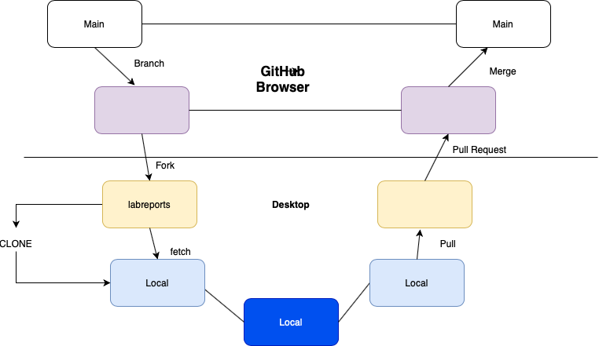
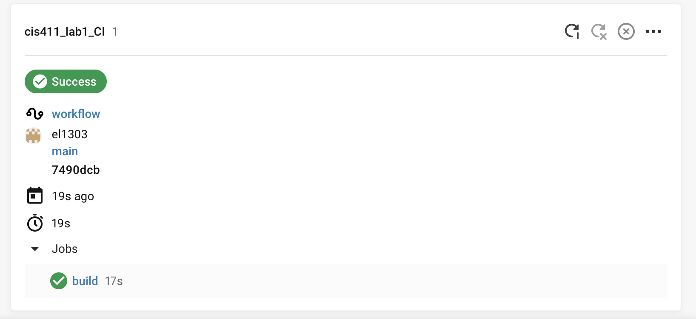

# Lab Report: Continuous Integration
___
**Course:** CIS 411, Spring 2021  
**Instructor(s):** [Trevor Bunch](https://github.com/trevordbunch)  
**Name:** Emily Lopez 
**GitHub Handle:** el1303  
**Repository:** el1303/cis411_lab1_CI
___

# Step 1: Fork this repository
- The URL of my forked repository: [Fork URL](https://github.com/el1303/cis411_lab1_CI.git)
- The accompanying diagram of what my fork precisely and conceptually represents 

# Step 2: Clone your forked repository from the command line  
- My local file directory is...
Documents/Github/CIS411_LAB1_CI
- The command to navigate to the directory when I open up the command line is... cd Doc tab Git tab cis tab 1 tab.

# Step 3: Run the application locally
- My GraphQL response from adding myself as an account on the test project
``` json
{
  "data": {
    "mutateAccount": {
      "id": "a1980ff5-94ad-40bd-be56-10f7a1a2ada0",
      "name": "Emily Lopez",
      "email": "lopezbbrezzy@gmail.com"
    }
  }
}
```

# Step 4: Creating a feature branch
- Output of Git command
```

lopezemilia@Lopezs-MacBook-Pro cis411_lab1_ci % git log -- oneline
lopezemilia@Lopezs-MacBook-Pro cis411_lab1_ci % ls
LAB_INSTRUCTIONS.md	dbutil.js		package.json
LICENSE			labreports		server.js
README.md		node_modules		test.json
assets			package-lock.json
lopezemilia@Lopezs-MacBook-Pro cis411_lab1_ci % git log --oneline 
c2eb50e (HEAD -> labreport, origin/labreport) Completed Report
277a990 Create circleci.png
b3d18bb Application Local
2cec448 Create config.yml
1e24349 your commit and reference @trevordbunch in the message
f8513e0 (origin/purelab, purelab) Update Node links to Instructions
d4f22eb Update repo branch names
0e3ae4c Reset purelab
050b420 Merge pull request #2 from trevordbunch/main
1fe415c Merge pull request #1 from trevordbunch/labreport
13e571f Update Lab readme, instructions and templates
eafe253 Adjust submitting instructions
47e83cd Add images to LabReport
ec18770 Add Images
dbf826a Answer Step 4
a9c1de6 Complete Step 1, 2 and 3 of LAB_TREVORDBUNCH
1ead543 remove LAB.md
8c38613 Initial commit of labreport with @tangollama
dabceca Merge pull request #24 from tangollama/circleci
a4096db Create README.md

```
- The accompanying diagram of what my feature branch precisely and conceptually represents... 

# Step 5: Setup a Continuous Integration configuration
- What is the .circleci/config.yml doing?  It's the file that the code runs through.


- What do the various sections on the config file do? 
   The sections declare a dependency and runs the job in it's own container.

- When a CI build is successful, what does that philosophically and practically/precisely indicate about the build?  
      - CI indicates that the build is able to run and ready to be released. Practically speaking there is nothing wrong with the build of the code.

   
- If you were to take the next step and ready this project for Continuous Delivery, what additional changes might you make in this configuration (conceptual, not code)? 
- Have the code go through all that is needed in requirements and write the code so it will be passed continuously from repository to production. 
   

# Step 6: Merging the feature branch
* The output of my git commit log
```
b3d18bb (HEAD -> labreport, origin/labreport) 
a4096db Create README.md
2f01bf4 Update LAB_INSTRUCTIONS.md
347bd50 Update LAB_INSTRUCTIONS.md
7aaa9f3 Update LAB_INSTRUCTIONS.md

```

* A screenshot of the _Jobs_ list in CircleCI


# Step 7: Submitting a Pull Request
_Remember to reference at least one other student in the PR content via their GitHub handle._


# Step 8: [EXTRA CREDIT] Augment the core project
PR reference in the report to one of the following:
1. Add one or more unit tests to the core assignment project. 
2. Configure the CircleCI config.yml to automatically build a Docker image of the project.
3. Configure an automatic deployment of the successful CircleCI build to an Amazon EC2 instance.
