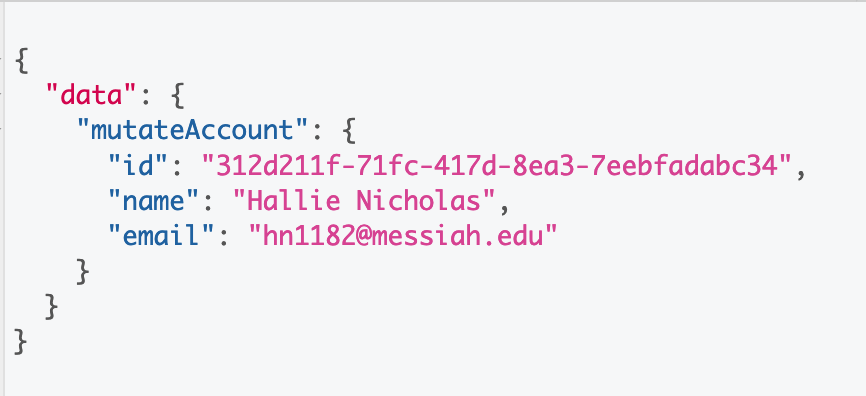
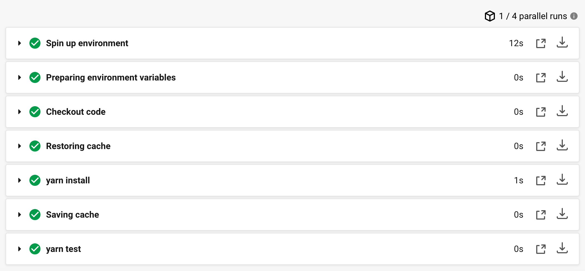
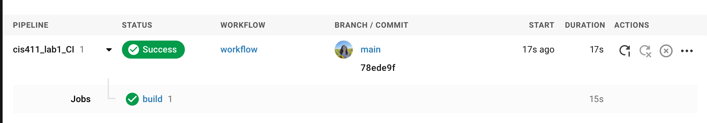

# Lab Report: Continuous Integration
___
**Course:** CIS 411, Spring 2021  
**Instructor(s):** [Trevor Bunch](https://github.com/trevordbunch)  
**Name:** Hallie Nicholas 
**GitHub Handle:** hallienicholas 
**Repository:** hallienicholas /
cis411_lab1_CI
___

# Step 1: Fork this repository
- The URL of my forked repository: https://github.com/hallienicholas/cis411_lab1_CI.git
- The accompanying diagram of what my fork precisely and conceptually represents...
  

# Step 2: Clone your forked repository from the command line  
- My local file directory is... c:Documents/Github/cis411_lab1_CI
- The command to navigate to the directory when I open up the command line is...
  cd Documents/GitHub/cis411_lab1_CI

# Step 3: Run the application locally
- My GraphQL response from adding myself as an account on the test project


# Step 4: Creating a feature branch
- The output of my git commit log
```
Hallies-MacBook-Pro:cis411_lab1_CI hallie1$ git log --oneline
6518b25 (HEAD -> labreports, origin/labreports) Create LAB_hallienicholas.md
78ede9f (origin/main, origin/HEAD, main) Corrected error
1fe415c Merge pull request #1 from trevordbunch/labreport
13e571f Update Lab readme, instructions and templates
eafe253 Adjust submitting instructions
47e83cd Add images to LabReport
ec18770 Add Images
dbf826a Answer Step 4
a9c1de6 Complete Step 1, 2 and 3 of LAB_TREVORDBUNCH
1ead543 remove LAB.md
8c38613 Initial commit of labreport with @tangollama
dabceca Merge pull request #24 from tangollama/circleci
a4096db Create README.md
```
- The accompanying diagram of what my feature branch precisely and conceptually represents... fork commit and push
  

# Step 5: Setup a Continuous Integration configuration

1) **What is the .circleci/config.yml doing?**
  
Each time it goes through the code, there is sequence of steps it cycles through which can be seen in the image below. First, it starts the environment and gets everything going. Then, it makes sure the code is working together and branches are up to date. After that, the cache is restored and installs dependencies for the project. Finally it saves the cache and makes sure the dependencies are running properly.



2) **What do the various sections on the config file do?**

   The process it goes through is described in some detail above, but when it comes to the actual code, the config file first tells you which version it is. After this, it gets into the processes it will carry out. After the image that it includes, you can specify dependencies and view which working directory it is in. For the main steps, it first checks out the code to the working directory to make it easier. Then, if there is a previously saved cache based on a key, it is restored. 
   
   Under that, it calls for any dependencies to be downloaded and cached that might be necessary for implementation. There is then a run function with a "yarn install" command which installs those specified dependencies. The cache is then saved and paths and keys are specified. Last, the command "yarn test" is run which runs the specified build and results are returned.

  3) **When a CI build is successful, what does that philosophically and practically/precisely indicate about the build?**

  This indicates philosophically that the build has entered into the VM and is fit to run as it should, thus being ready for release. Practically speaking, it has been debugged and there doesn't seem to be anything wrong with the build.

  4) **If you were to take the next step and ready this project for Continuous Delivery, what additional changes might you make in this configuration (conceptual, not code)?**
   

   

# Step 6: Merging the feature branch
* The output of my git commit log
```
Hallies-MacBook-Pro:cis411_lab1_CI hallie1$ git log --oneline
6518b25 (HEAD -> labreports, origin/labreports) Create LAB_hallienicholas.md
78ede9f (origin/main, origin/HEAD, main) Corrected error
1fe415c Merge pull request #1 from trevordbunch/labreport
13e571f Update Lab readme, instructions and templates
eafe253 Adjust submitting instructions
47e83cd Add images to LabReport
ec18770 Add Images
dbf826a Answer Step 4
a9c1de6 Complete Step 1, 2 and 3 of LAB_TREVORDBUNCH
1ead543 remove LAB.md
8c38613 Initial commit of labreport with @tangollama
dabceca Merge pull request #24 from tangollama/circleci
a4096db Create README.md
2f01bf4 Update LAB_INSTRUCTIONS.md
347bd50 Update LAB_INSTRUCTIONS.md
7aaa9f3 Update LAB_INSTRUCTIONS.md
37393ae Bug fixed
1949d2a Update LAB_INSTRUCTIONS.md
d36ad90 Update LAB.md
59ef18a Update LAB_INSTRUCTIONS.md
37be3c8 Update LAB_INSTRUCTIONS.md
97da547 Update LAB.md
0bd6244 updated Step 0 title
(END)
```

* A screenshot of the _Jobs_ list in CircleCI


# Step 7: Submitting a Pull Request
_Remember to reference at least one other student in the PR content via their GitHub handle._

@isaacparada


# Step 8: [EXTRA CREDIT] Augment the core project
PR reference in the report to one of the following:
1. Add one or more unit tests to the core assignment project. 
2. Configure the CircleCI config.yml to automatically build a Docker image of the project.
3. Configure an automatic deployment of the successful CircleCI build to an Amazon EC2 instance.
