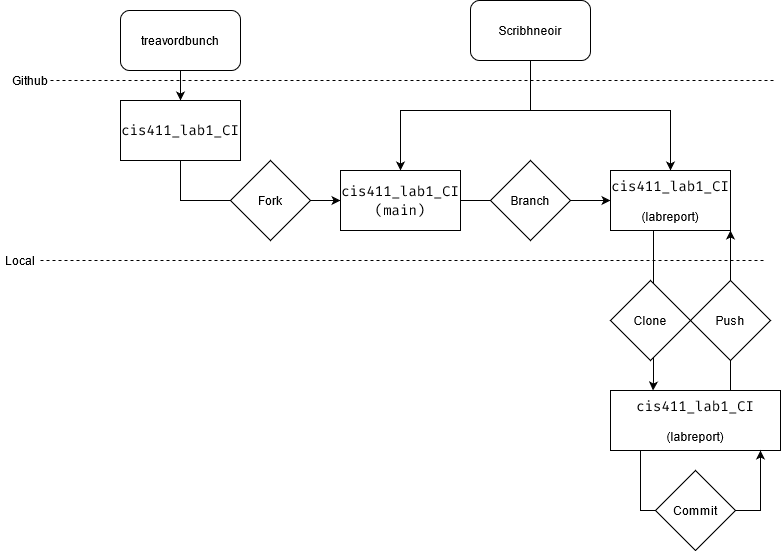

# Lab Report: Continuous Integration
___
**Course:** CIS 411, Spring 2021  
**Instructor(s):** [Trevor Bunch](https://github.com/trevordbunch)  
**Name:** Josiah McCracken  
**GitHub Handle:** Scribhneoir  
**Repository:** [Repo](https://github.com/scribhneoir/cis411_lab1_CI)  
___

# repository and diagrams
- [Repo](https://github.com/scribhneoir/cis411_lab1_CI)


# Clone your forked repository from the command line  
- My local file directory is... C:/users/Josiah/cis411_lab1_CI
- The command to navigate to the directory when I open up the command line is... cd C:/users/Josiah/cis411_lab1_CI

# Run the application locally
- My GraphQL response from adding myself as an account on the test project
``` json
{
  "data": {
    "mutateAccount": {
      "id": "1a8d3cf0-2f1b-49d9-98f2-fd2ef6a17d3d",
      "name": "Josiah McCracken",
      "email": "positron@windstream.net"
    }
  }
}
```

# Creating a feature branch
- The output of my git commit log
```
7490dcb (HEAD -> labreport, origin/main, origin/labreport, origin/HEAD, main) Add Links to Node in Instructions
ecaaa53 Update branch terminology
:...skipping...
7490dcb (HEAD -> labreport, origin/main, origin/labreport, origin/HEAD, main) Add Links to Node in Instructions
ecaaa53 Update branch terminology
c552213 Merge pull request #3 from hallienicholas/main
78ede9f Corrected error
1fe415c Merge pull request #1 from trevordbunch/labreport
13e571f Update Lab readme, instructions and templates
eafe253 Adjust submitting instructions
47e83cd Add images to LabReport
ec18770 Add Images
dbf826a Answer Step 4
a9c1de6 Complete Step 1, 2 and 3 of LAB_TREVORDBUNCH
1ead543 remove LAB.md
8c38613 Initial commit of labreport with @tangollama
dabceca Merge pull request #24 from tangollama/circleci
a4096db Create README.md
2f01bf4 Update LAB_INSTRUCTIONS.md
347bd50 Update LAB_INSTRUCTIONS.md
7aaa9f3 Update LAB_INSTRUCTIONS.md
37393ae Bug fixed
1949d2a Update LAB_INSTRUCTIONS.md
d36ad90 Update LAB.md
59ef18a Update LAB_INSTRUCTIONS.md
```
- The accompanying diagram of what my feature branch precisely and conceptually represents...

# Setup a Continuous Integration configuration
- What is the .circleci/config.yml doing?  
This config file seems to outline things for CircleCI to do once an update occurs in a repository. CircleCI's documentation states that it will run the jobs (build in our config file) in seperate VMs.

- What do the various sections on the config file do?  
Version denotes the circle CI version
Jobs houses the seperate jobs to be run. Our file only has build, but test is another common job.
Within build, we have the steps it will run inside the VM. This can run basic commands (i.e. run: yarn install) or do more complex things (I assume whatever is being done with docker)

- When a CI build is successful, what does that philosophically and practically/precisely indicate about the build?  
If it is sucessful, all of the steps within each job have run sucessfully. All tests have passed, any configured deployments were performed, etc.
   

- If you were to take the next step and ready this project for Continuous Delivery, what additional changes might you make in this configuration (conceptual, not code)?  
I would add a deployment enviornment and maybe add a test job.
   

# Merging the feature branch
* The output of my git commit log
```
Trevors-MBP:cis411_lab0 trevorbunch$ git log --oneline
dbf826a (HEAD -> labreport, origin/labreport) Answer Step 4
a9c1de6 Complete Step 1, 2 and 3 of LAB_TREVORDBUNCH
1ead543 remove LAB.md
8c38613 Initial commit of labreport with @tangollama
dabceca (upstream/main, origin/main, origin/HEAD, main) Merge pull request #24 from tangollama/circleci
a4096db Create README.md
...
44ce6ae Initial commit
(END)
```

* A screenshot of the _Jobs_ list in CircleCI


# [EXTRA CREDIT] Augment the core project
PR reference in the report to one of the following:
1. Add one or more unit tests to the core assignment project. 
2. Configure the CircleCI config.yml to automatically build a Docker image of the project.
3. Configure an automatic deployment of the successful CircleCI build to an Amazon EC2 instance.
